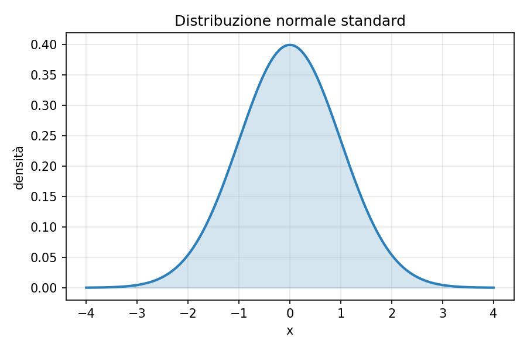

[← Torna all'indice](../../index.html)

## La distribuzione normale

La funzione di densità della distribuzione normale standard è data da:

$$
f(x) = \frac{1}{\sqrt{2\pi}} \, e^{-\frac{x^2}{2}}
$$ {#eq-normale}

L'@eq-normale descrive la classica curva a campana, mostrata in @fig-normale.

{#fig-normale width=70%}

## Ricerca binaria

L'@algo-ricerca-binaria mostra lo pseudocodice per la ricerca di un elemento
in un array ordinato.

```pseudocode
#| label: algo-ricerca-binaria
#| caption: Ricerca binaria

\begin{algorithm}
\caption{Ricerca binaria}
\begin{algorithmic}
\Procedure{RicercaBinaria}{$A, target$}
  \State $sinistra \gets 0$
  \State $destra \gets \Call{Lunghezza}{A} - 1$
  \While{$sinistra \leq destra$}
    \State $mid \gets \lfloor (sinistra + destra) / 2 \rfloor$
    \If{$A[mid] = target$}
      \Return $mid$
    \ElsIf{$A[mid] < target$}
      \State $sinistra \gets mid + 1$
    \Else
      \State $destra \gets mid - 1$
    \EndIf
  \EndWhile
  \Return $-1$
\EndProcedure
\end{algorithmic}
\end{algorithm}
```

L'@algo-ricerca-binaria ha complessità $O(\log n)$.

## Confronto tra distribuzioni

La @tbl-distribuzioni riassume media e varianza di alcune distribuzioni comuni.

| Distribuzione | Media | Varianza |
|---|---|---|
| Normale standard | $0$ | $1$ |
| Uniforme su $[0,1]$ | $0.5$ | $1/12$ |
| Esponenziale ($\lambda$) | $1/\lambda$ | $1/\lambda^2$ |

: Media e varianza di alcune distribuzioni {#tbl-distribuzioni}

Come mostrato nella @tbl-distribuzioni, la distribuzione normale standard ha
media nulla e varianza unitaria.
