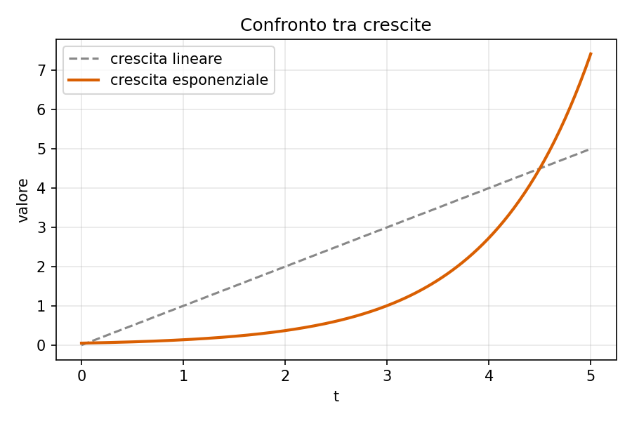
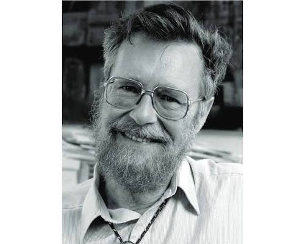

[← Torna all'indice](../../index.html)

## Crescita esponenziale

Una quantità che cresce esponenzialmente nel tempo segue la legge:

$$
N(t) = N_0 \, e^{rt}
$$ {#eq-crescita}

dove $N_0$ è il valore iniziale e $r$ il tasso di crescita. L'@eq-crescita è
illustrata in @fig-crescita, a confronto con una crescita lineare.

{#fig-crescita width=70%}

## Massimo comun divisore

L'@algo-euclide mostra l'algoritmo di Euclide per il calcolo del massimo
comun divisore fra due interi.

```pseudocode
#| label: algo-euclide
#| caption: Algoritmo di Euclide

\begin{algorithm}
\caption{Euclide}
\begin{algorithmic}
\Procedure{MCD}{$a, b$}
  \While{$b \neq 0$}
    \State $r \gets a \bmod b$
    \State $a \gets b$
    \State $b \gets r$
  \EndWhile
  \Return $a$
\EndProcedure
\end{algorithmic}
\end{algorithm}
```

L'@algo-euclide termina sempre, poiché ad ogni iterazione il resto diminuisce
strettamente.

## Confronto tra ordini di crescita

La @tbl-crescite riassume alcuni ordini di crescita comuni in informatica.

| Notazione | Nome | Esempio tipico |
|---|---|---|
| $O(\log n)$ | Logaritmica | Ricerca binaria |
| $O(n)$ | Lineare | Scansione di un array |
| $O(n \log n)$ | Quasi lineare | Merge sort |
| $O(2^n)$ | Esponenziale | Forza bruta su sottoinsiemi |

: Ordini di crescita comuni {#tbl-crescite}

Come mostra la @tbl-crescite, l'algoritmo di ricerca binaria del capitolo
precedente appartiene alla classe più efficiente tra quelle elencate.

::: {.callout-note title="Dijkstra"}
::: {layout-ncol=2}
{#fig-dijkstra width=90%} 

(Rotterdam, 11 maggio 1930 – Nuenen, 6 agosto 2002) è stato un informatico olandese. I suoi più importanti contributi all'informatica sono stati il cosiddetto "algoritmo di Dijkstra" e il concetto informatico di "semaforo".
È anche noto per la pessima opinione espressa a proposito dell'uso dell'istruzione GOTO nella programmazione, culminata nel celebre articolo del 1968 Go To Statement Considered Harmful, considerato come uno dei passi fondamentali verso il rifiuto generalizzato dell'istruzione GOTO nei linguaggi di programmazione e della sua sostituzione con più funzionali strutture di controllo come il ciclo while.
:::
:::

::: {.callout-tip title="Suggerimento"}
Per generalizzare a media e varianza qualsiasi, basta applicare la
trasformazione $X = \mu + \sigma Z$, dove $Z$ è normale standard.
:::