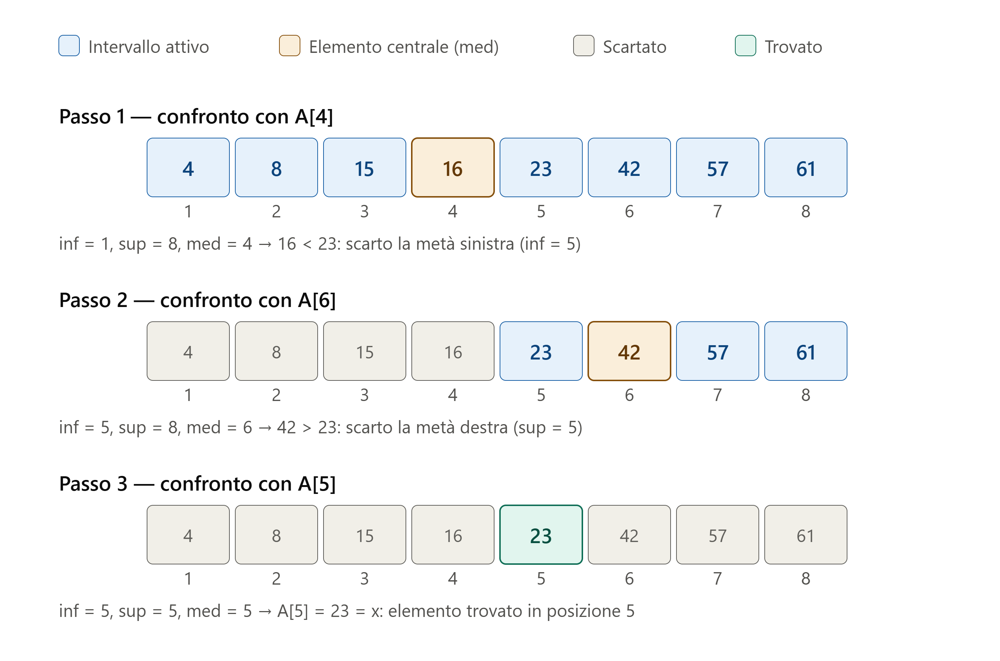
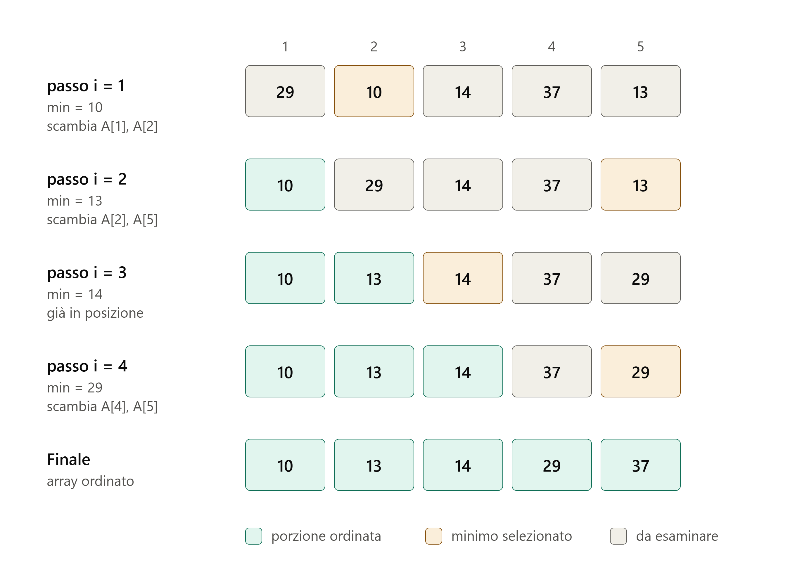

[← Torna all'indice](../../index.html)

## La ricerca binaria

La ricerca binaria (o ricerca dicotomica) è un algoritmo che determina la **posizione** $pos$ di un **elemento** $X$ in un **array ordinato** $A$ di **lunghezza** $N$. 
Nel caso in cui $X$ non è presente in $A$, l'algoritmo restituisce convenzionalmente $pos=-1$. 
La precondizione fondamentale è che l'array sia ordinato: senza di essa l'algoritmo non funziona. L'idea è quella del "divide et impera". Più precisamente, invece di scorrere l'array elemento per elemento (come nella ricerca sequenziale), l'algoritmo confronta l'elemento cercato con quello che si trova in posizione centrale dell'intervallo di ricerca corrente. Si presentano tre casi. Se l'elemento centrale è uguale a quello cercato, allora si è trovata la posizione e la ricerca termina con successo. Altrimenti, se l'elemento cercato è minore di quello centrale, esso può trovarsi solo nella metà sinistra, quindi la metà destra viene scartata. Se invece è maggiore, può trovarsi solo nella metà destra, e viene scartata la metà sinistra. Il procedimento si ripete sulla metà rimanente, dimezzando a ogni passo l'intervallo di ricerca, finché l'elemento viene trovato oppure l'intervallo di ricerca corrente si svuota, condizione che indica che l'elemento non è presente.

**Esempio**

Ricerca dell'elemento $X = 23$ in un array $A$ di $N=8$ elementi.

{#fig-ricbin width=80%}

**Algoritmo**

```pseudocode
#| label: algo-ricbin
#| caption: Algoritmo di Ricerca Binaria

\begin{algorithm}
\caption{Ricerca binaria}
\begin{algorithmic}
\State \textbf{procedure} $ricbin(in:\; N, A, X; \; out:\;  pos)$
\State \textbf{var}: $inf, sup, med, pos$ \textbf{integer}
\State \textbf{var}: $X$\textbf{real}
\State \textbf{array}: $A[N]$ \textbf{real}
\State
\State $inf = 1$
\State $sup = N$
\State $pos = -1$ 
\While{($inf \leq sup $ \textbf{and} $ pos == -1$)} 
  \State $med = \lfloor (inf + sup) / 2 \rfloor$ 
  \If{ ($A[med] == X$) } 
    \State $pos = med$ 
  \Else
    \If{( $A[med] <X$) }
      \State $inf = med + 1$ 
    \Else
      \State $sup = med - 1$ 
    \EndIf
  \EndIf
\EndWhile
\State \textbf{end procedure}

\end{algorithmic}
\end{algorithm}
```
* le variabili $inf$ e $sup$ rappresentano gli estremi dell'intervallo di ricerca
* la variabile $med$ è l'indice dell'elemento centrale di $A$
* La struttura _while_ (riga 9) determina il criterio di arresto (intervallo di ricerca vuoto oppure elemento trovato)
* La struttura di selezione a riga 11 confronta $X$ con l'elemento centrale di $A$
* La struttura di selezione a riga 14 verifica se $X$ è precedente o successivo all'elemento centrale

**Complessità computazionale**

* **Caso migliore**: l'elemento viene trovato subito in posizione centrale, quindi $T(N) = 1$ confronti, cioè $T(N) \in O(1)$. 
* **Caso peggiore**: poiché a ogni iterazione l'intervallo di ricerca si dimezza, la complessità è $T(N) = 2\log (N)$ cioè $T(N)\in\Omega(\log (N))$ (se $N$ è potenza di 2), contro $T(N) = N$ della ricerca sequenziale.


<!-- ================================================================================================================== -->

## L'ordinamento per selezione

L'ordinamento per selezione ordina un **array** $A$ di **lunghezza** $N$ operando _in place_ (cioè senza l'utilizzo di array supplementari). 
Esso opera per passi dove, ad ogni passo, l'array risulta partizionato in due sezioni. Detto $i$ l'indice del passo, la sezione $A[1,..,i-1]$ risulta già ordinata, mentre la rimanente $A[i,..,N]$ è ancora da ordinare.
L'algoritmo, allora, **seleziona** l'elemento minimo nella sezione non ordinata $A[i..N]$, individuandone la posizione $pos$,
e lo sposta in posizione $i$ mediante uno scambio con $A[i]$. Dopo lo scambio la porzione ordinata dell'array si allunga di una posizione 
e contiene gli $i$ elementi più piccoli dell'intero array, già nella loro posizione ordinata definitiva, mentre la sezione non ordinata si riduce di un elemento.
Dopo $N-1$ iterazioni l'elemento in posizione $N$ è necessariamente il massimo e l'array risulta ordinato.

**Esempio**

Ordinamento di un array $A$ di $N=5$ elementi.

{#fig-ordsel width=80%}

**Algoritmo**

```pseudocode
#| label: algo-ordsel
#| caption: Algoritmo di Ordinamento per Selezione

\begin{algorithm}
\caption{Ordinamento per selezione}
\begin{algorithmic}
\State \textbf{procedure} $ordsel(in:\; N, A; \; out:\;  A)$
\State \textbf{var}: $i, j, pos$ \textbf{integer}
\State \textbf{var}: $T$ \textbf{real}
\State \textbf{array}: $A[N]$ \textbf{real}
\State
\For{$i = 1$ \textbf{to} $N-1$}
    \State $pos = i$ 
    \For{$j = i+1$ \textbf{to} $N$}
        \If{$A[j] < A[pos]$}
            \State $pos = j$
        \EndIf
    \EndFor
    \If{$pos \neq i$}
        \State $T = A[pos]$
        \State $A[pos] = A[i]$
        \State $A[i] = T$ 
    \EndIf
\EndFor
\State \textbf{end procedure}

\end{algorithmic}
\end{algorithm}
```

* le istruzioni da 7 a 12 rappresentano la ricerca del minimo nella sezione on ordinata $A[i,..,N]$
* le istruzioni da 14 a 16 rappresentano lo scambio tra il minimo in $A[i,..,N]$ e $A[i]$
* lo scambio viene effettuato solo se il minimo non è già nella posizione giusta (controllo di riga 13)

**Complessità computazionale**

L'algoritmo esegue sempre $N-1$ iterazioni, per cui effettua sempre $T(N) = \sum_{i=1}^{N-1} (N-i) = \frac{N(N-1)}{2}$ confronti, indipendentemente dalla disposizione iniziale dei dati. 
La complessità asintotica è dunque $T(N)\in O(N^2)$ in ogni caso. Gli scambi sono al più $N-1$ nel caso peggiore (ad esempio per l'array $A =[2, 3, 4, 5, 1]$) oppure nessuno se l'array è già ordinato.
Poichè l'ordinamento avviene in place la complessità di spazio è $S(N) = N$.


<!-- ================================================================================================================== -->

## L'ordinamento per scambi

L'ordinamento per scambi ordina un **array** $A$ di **lunghezza** $N$ operando _in place_ (cioè senza l'utilizzo di array supplementari). 
Esso opera per passi dove, ad ogni passo, l'array risulta partizionato in due sezioni. Detto $i$ l'indice del passo, inizialmente la sezione $A[N-i+2,..,N]$ risulta già ordinata, mentre la rimanente $A[1,..,N-i+1]$ è ancora da ordinare.
L'algoritmo, allora, confronta gli elementi adiacenti due a due nella sezione non ordinata, scambiando quelli non in ordine. Dopo la serie di confronti e scambi nell'$i$-mo passo, la porzione ordinata dell'array si allunga di una unità 
e contiene nella sezione $A[N-i+1,..,N]$ gli $i$ elementi più grandi dell'intero array, mentre la sezione non ordinata si riduce di un elemento.
Dopo $N-1$ iterazioni l'array risulta ordinato. E' opportuno osservare, però, che se in una iterazione non avvengono scambi, vuol dire che gli elementi adiacenti sono già in ordine due a due e pertanto l'algoritmo può terminare. Ciò si ottiene con una struttura di iterazione _repeat_ che termina quando si sono compiute le $N-1$ previste oppure se non vengono effettuati scambi.  

**Esempio**

Ordinamento di un array $A$ di $N=5$ elementi.

{#fig-ordsel width=80%}

**Algoritmo**

```pseudocode
#| label: algo-ordsca
#| caption: Algoritmo di Ordinamento per Scambi

\begin{algorithm}
\caption{Ordinamento per scambi}
\begin{algorithmic}
\State \textbf{procedure} $ordsca(in:\; N, A; \; out:\;  A)$
\State \textbf{var}: $i, j, S$ \textbf{integer}
\State \textbf{var}: $T$ \textbf{real}
\State \textbf{array}: $A[N]$ \textbf{real}
\State
\State $i = 0$
\Repeat
    \State $i = i+ 1$
    \State $S = 0$
    \For{$j = 1$ \textbf{to} $N-i$}
        \If{$A[j] > A[j+1]$}
            \State $T = A[j]$
            \State $A[j] = A[j+1]$
            \State $A[j+1] = T$
            \State $S = 1$
        \EndIf
    \EndFor
\Until{($i = N-1$ \textbf{or} $S == 0$)}
\State \textbf{end procedure}

\end{algorithmic}
\end{algorithm}
```

* la struttura _repeat_ (riga 7) determina le iterazioni da eseguire
* la struttura _for_ (riga 10) scorre l'array all'interno del passo $i$ 
* la variabile $S$ definisce se sono stati effettuati scambi alla iterazione $i$ ($S==1$) oppure no ($S == 0$)

**Complessità computazionale**

* **Caso migliore** (array già ordinato) L'algoritmo scorre e confronta tutti le coppie di elementi adiacenti (righe 10 e 11) e non esegue mai scambi e quindi esegue solo l'iterazione con $i=1$. Ciò comporta $T(N) = N-1$ confronti + $0$ scambi 
* **Caso peggiore** (array in ordine inverso) L'algoritmo trova due elementi adiacenti sempre in ordine inverso, e per ogni confronto esegue uno scambio. Esso esegue quindi sempre $N-1$ iterazioni, in cui effettua $N-i$ confronti, per un totale di $T(N) =\sum_{i=1}^{i=N-1} (N-i) = \frac{N(N-1)}{2}$ confronti e altrettanti scambi

